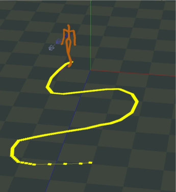
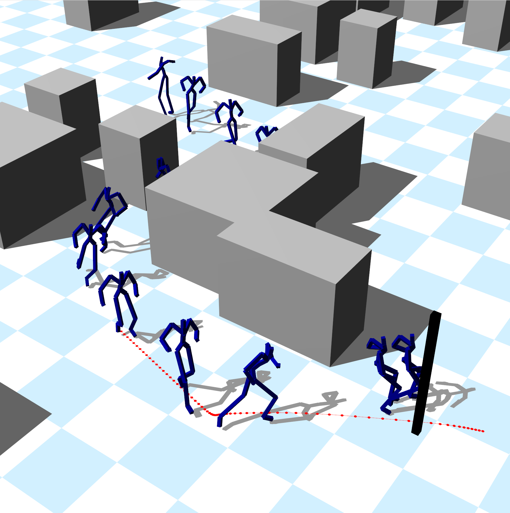
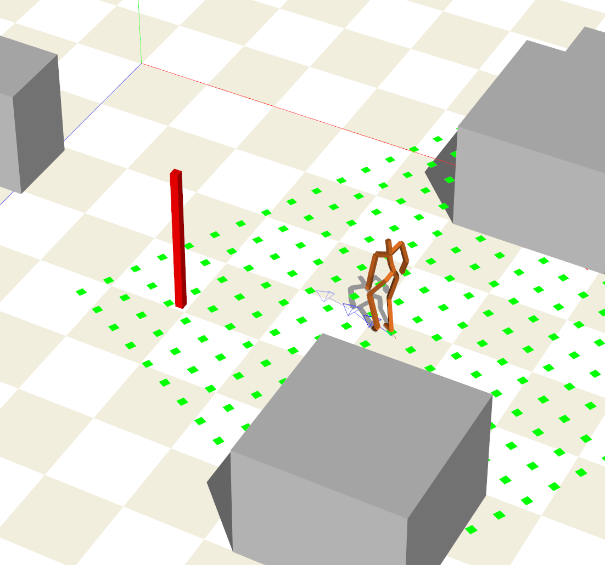

<!-- One -->
<section id="one">
	

		

<h2>Jeongmin Lee</h2>
Software Engineer of Samsung Research, Seoul, Korea, Sep.2022~ 
e-mail: j0064423@hanyang.ac.kr

    

</section>

## Education
B.S in Computer Science, Hanyang University, Seoul, Korea, Feb.2020 
M.S in Computer Science, Hanyang University, Seoul, Korea, Aug.2022 

## Experience
Software Engineer Intern at NAVER(Whale browser/FE), Seoul, Korea, Jul.2018-Aug.2018 
Undergraduate Researcher at CGR lab, Hanyang University, Seoul, Korea, Sep.2018-Feb.2020 

## Research Interests
Data-driven Character Animation 
Physically-Based Character Control 
Deep Reinforcement Learning
 
 
 
## Publications

<a target="_black" rel="noopener noreferrer" href="https://doi.org/10.15701/kcgs.2020.26.4.1">심층 강화 학습을이용한 Luxo 캐릭터의 제어</a> 
이정민, 이윤상  
컴퓨터그래픽스학회논문지, 제26권 제4호, 1-8, 2020.09. 

 

 

<a target="_black" rel="noopener noreferrer" href="https://gitcgr.hanyang.ac.kr/publications/domestic/2021-kcgs-2d-traj.pdf">2D 이동 경로 지정을 통한 모션 매칭 기반 캐릭터 모션 생성</a> 
이정민, 이윤상  
한국컴퓨터그래픽스학회 2021년 학술대회 논문집, 68-69, 2021.07. 

 

 

<a target="_black" rel="noopener noreferrer" href="https://gitcgr.hanyang.ac.kr/publications/domestic/2022-kcgs-interactivePathFollowing.pdf">모션 매칭을 활용한 상호작용적 캐릭터 경로 추적</a> 
이정민, 권태수, 이윤상  
한국컴퓨터그래픽스학회 2022년 학술대회 논문집, 36-37, 2022.07. 

 

 

<a target="_black" rel="noopener noreferrer" href="https://gitcgr.hanyang.ac.kr/publications/domestic/2022-kcgs-drlMotionMatching.pdf">심층 강화 학습과 모션 매칭을 이용한 캐릭터 애니메이션 생성</a> 
이정민, 권태수, 이윤상  
한국컴퓨터그래픽스학회 2022년 학술대회 논문집, 65-66, 2022.07. 

