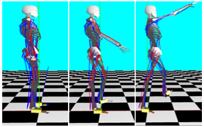

<!-- One -->
<section id="one">
	

		

<h2>Minkwan Kim</h2>

B.S in Computer Science, Hanyang University, Seoul, Korea, Feb.2021 
Room 111, R&D Building 
e-mail: palkan21@hanyang.ac.kr

<a target="_blank" rel="noopener noreferrer" href="http://cs.hanyang.ac.kr/">Department Of Computer Science</a>
 
<a target="_blank" rel="noopener noreferrer" href="https://www.hanyang.ac.kr/">Hanyang University</a>

	

</section>

## Research Interests
Physically-Based Character Control
 Deep Neural Network
 
 
 
## Publications

<a target="_black" rel="noopener noreferrer" href="https://gitcgr.hanyang.ac.kr/publications/domestic/2022-kcgs-NoRefMusculoSkeletalLocomotion.pdf">참조 모션을 사용하지 않는 근골격계 캐릭터의 보행 모션 학습</a> 
김민관, 이윤상 
한국컴퓨터그래픽스학회 2022년 학술대회 논문집, 61-62, 2022.07. 

