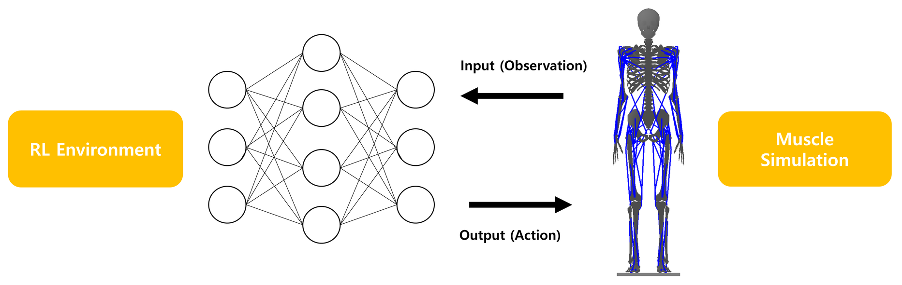
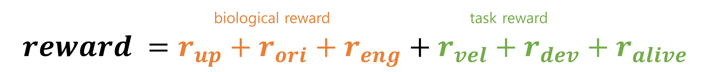
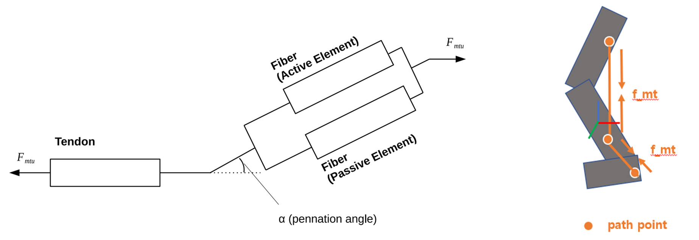

[Minkwan Kim](../people/minkwan-kim.html), [Yoonsang Lee](../people/yoonsang-lee.html)  
SIGGRAPH 2023 Posters

## Abstract
We propose a method of learning a policy for human-like locomotion via deep reinforcement learning based on a human anatomical model, muscle actuation, and biologically inspired rewards, without any inherent control rules or reference motions.
Our main ideas involve providing a dense reward using metabolic energy consumption at every step during the initial stages of learning and then transitioning to a sparse reward as learning progresses,
and adjusting the initial posture of the human model to facilitate the exploration of locomotion.
Additionally, we compared and analyzed differences in learning outcomes across various settings other than the proposed method.

## Video 

 

<iframe width="1536" height="864" src="https://www.youtube.com/embed/QPGUvpJm_Hk" title="Learning Human-like Locomotion Based on Biological Actuation and Rewards" frameborder="0" allow="accelerometer; autoplay; clipboard-write; encrypted-media; gyroscope; picture-in-picture; web-share" allowfullscreen></iframe>

  

## System Overview

Input of the policy is an observation, which is composed of rigid body states and muscle states of our fullbody model (284 dim).  
Output of the policy is an action, which is muscle activation used for controlling our musculoskeletal humanoid via muscle-actuated simulation (120 dim).

## Reinforcement Learning

Policy (fully connected network) is updated to maximize reward, which is sum of biological reward term and task reward term.  
Biological term reflects the common characteristics of locomotion that keep balance of upper body and minimize energy consumption.  
Task reward term avoid falling over for as long as possible and encourage model to achieve desired velocity (1.5m/sec)

## Our Strategy
We first train our policy with a dense energy reward and then fine-tuning our policy with a sparse energy reward. 
In early stage, the policy’s activation often result in movements with high energy consumption and instability.
The dense reward (MET) aids in rapidly stabilizing the movements, facilitating the discovery of a policy that can maintain balance over multiple steps. Afterward, switching to the sparse reward (CoT) encourages covering longer distances even with the same energy consumption, effectively increasing the travel distance. 
We introduce randomized starting position of lifting either left or right leg at the beginning of each episode, to increase the probability of exploring actions that naturally swinging the lifted leg and stably contact with the ground.

## Muscle Simulation

We use hill-type muscle actuated model(left of the figure) which is composed of fiber and tendon, where muscle force is calculated by muscle length, muscle velocity and muscle activations via equation. And then, calculated muscle force is applied between path points(right of the figure) attached to each rigid link.

## Paper 
[Download paper pdf](https://dl.acm.org/doi/pdf/10.1145/3588028.3603646)  
[Download supplement material pdf](https://dl.acm.org/action/downloadSupplement?doi=10.1145%2F3588028.3603646&file=supp.pdf)  
[Download conference poster pdf](https://dl.acm.org/action/downloadSupplement?doi=10.1145%2F3588028.3603646&file=poster-v2.pdf)  
[ACM digital library link](https://dl.acm.org/doi/abs/10.1145/3588028.3603646)  

